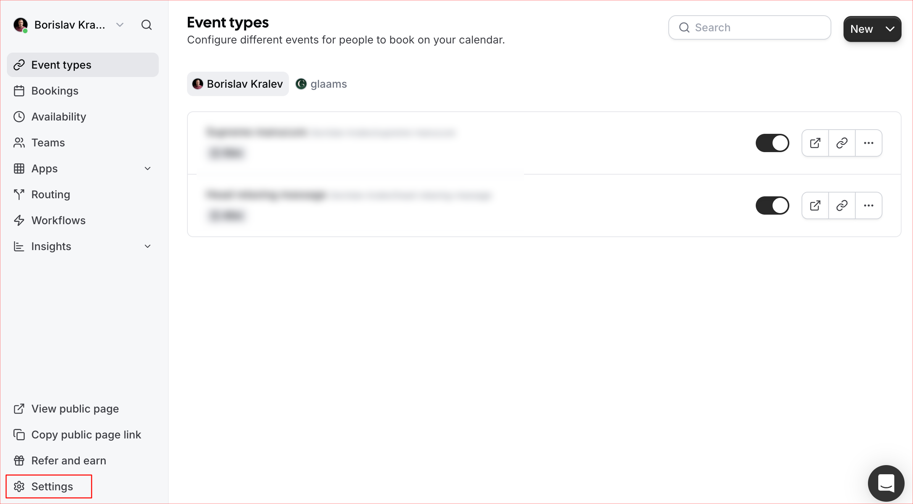
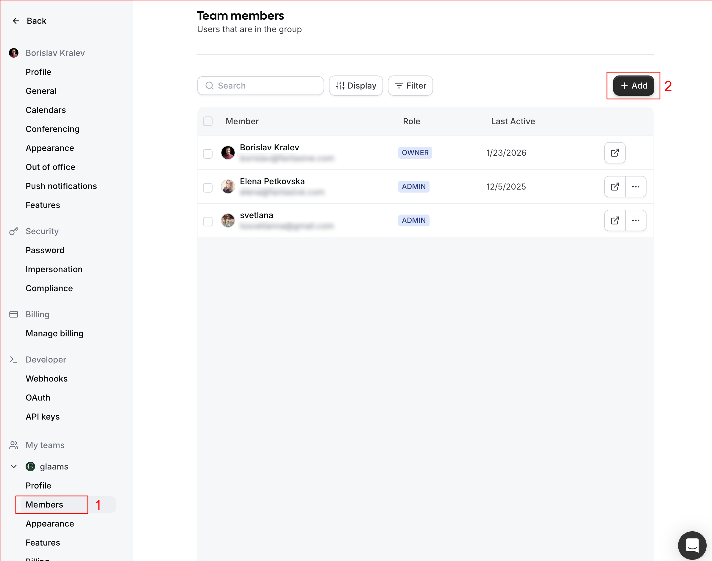
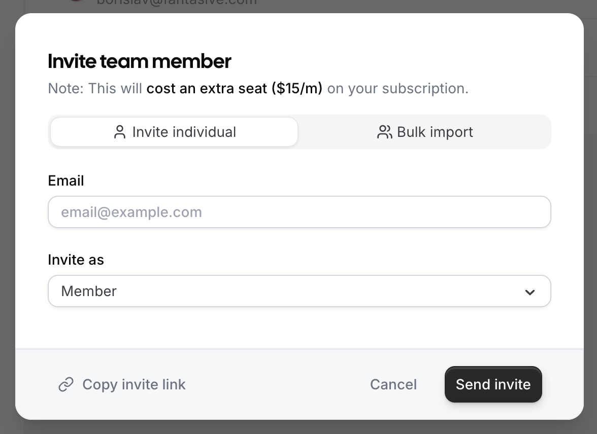
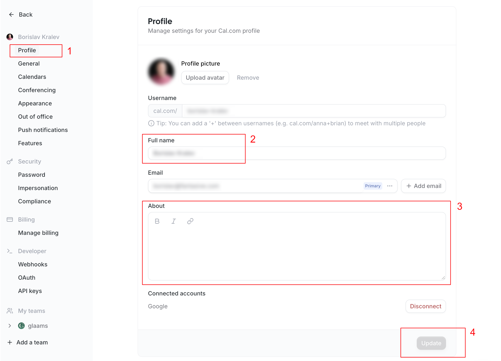
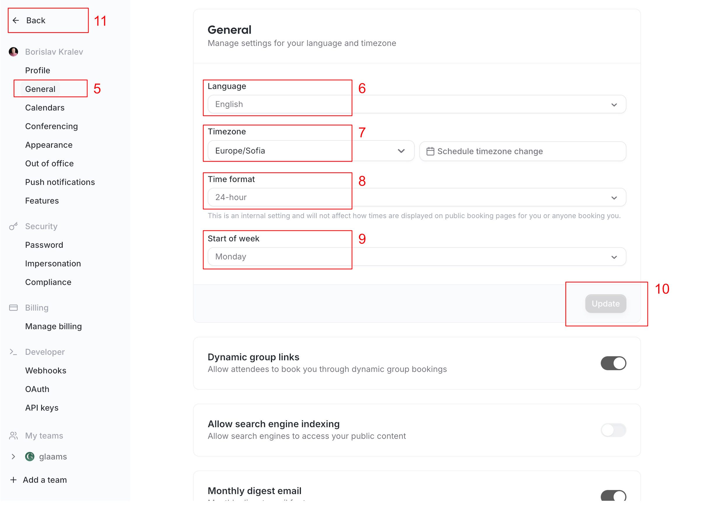
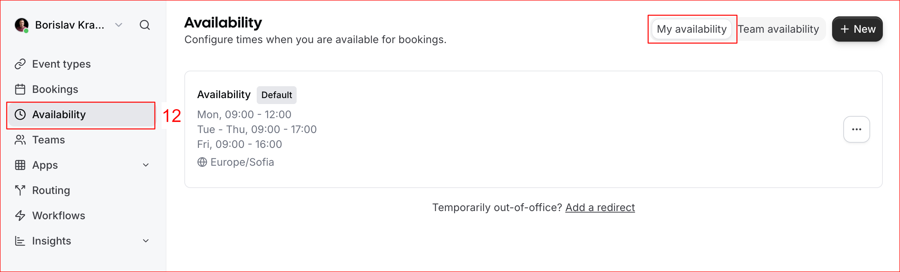
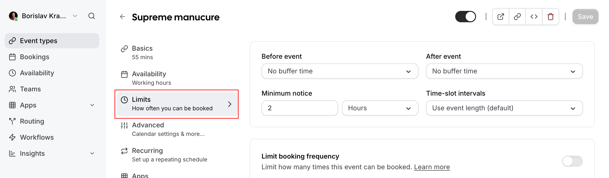

# Инструкции за работа с проекта GLAAMS

Този документ описва инструкциите за работа с проекта GLAAMS, включващи добавяне на специалисти, услуги, конфигурации и други административни задачи. Документът покрива целия процес от настройката в cal.com до създаването на записи в GLAAMS CMS.

---

## 1. Добавяне на специалист в cal.com (Админ)

**Извършва се от:** Администратор

Администраторът добавя специалиста в cal.com в тийм **glaams** като **MEMBER**.

### Скрийншоти:







---

## 2. Регистрация на специалист в cal.com (Специалист)

**Извършва се от:** Специалист

Специалистът се регистрира в cal.com чрез автоматично изпратения имейл линк.

---

## 3. Настройка на профил в cal.com (Специалист)

**Извършва се от:** Специалист

Специалистът настройва необходимите полета в своя профил:

- **Име** (Name)
- **Имейл адрес** (Email)
- **Език** (Language)
- **Timezone** (Часови пояс)
- **Time format** (Формат на времето)
- **Start of week** (Начало на седмицата)
- **Google календар** - избира се за синхронизация
- **Availability** - задават се дни от седмицата и часови диапазони, в които специалистът ще предлага услугите си. Тази информация излиза в страницата на специалиста като "Работно време" и има общ характер. Отсъствия, почивки, лични ангажименти и т.н. ще могат да се добавят в последствие през Google календар и по този начин специалистът ще определя кога в действителност е наличен.

### Скрийншоти:







---

## 4. Създаване на Event Types в cal.com (Специалист)

**Извършва се от:** Специалист

Специалистът добавя собствени Event Types (типове събития):

### Стъпки:

1. **Създаване на нов Event Type:**
   - Добавя заглавие (Title)
   - Добавя описание (Description)
   - Задава продължителност (Duration)

2. **Настройка на локация:**
   - **Задължително** се избира "**In Person (Attendee Address)**"
   - Това означава, че услугата се извършва на адреса на клиента

3. **Запазване на настройките**


---

## 5. Задаване на лимити в cal.com (Специалист)

**Извършва се от:** Специалист

Специалистът задава следните лимити:

- **Буферно време преди събитието** (Buffer time before event)
- **Буферно време след събитието** (Buffer time after event)
- **Time-slot интервал** (Time-slot interval) - интервалите за избор на време, които ще се показват в страницата с услугите на специалиста



---

## 6. Добавяне на специалист в GLAAMS (Админ)

**Извършва се от:** Администратор

### Стъпки:

1. **Достъп до Content Manager:**
   - Content Manager → Specialist → Create new entry

2. **Попълване на задължителни полета:**
   - Попълват се всички задължителни полета
   - По-голямата част от информацията трябва да бъде предоставена от специалиста или да бъде взета от профила му в cal.com

3. **Важни полета:**
   - **Languages** - използва се в листинга със специалисти за филтриране
   - **Locations** - използва се в листинга със специалисти за филтриране
   - **Services** - използва се в листинга със специалисти за филтриране
     - ⚠️ **Важно:** Ако специалистът предлага услуга, която не е добавена, следва да се добави Service предварително

4. **Поле "calUsername":**
   - Попълва се с **"Username"** от профила на специалиста в cal.com
   - Това поле е критично за свързването между GLAAMS и cal.com

5. **Поле "serviceConfigs":**
   - ⚠️ **Не се редактира** - ще бъде попълнено автоматично, след като бъдат създадени конфигурациите за специалиста

6. **Запазване:**
   - Save
   - Publish

---

## 7. Създаване на конфигурации за специалист (Админ)

**Извършва се от:** Администратор

### Стъпки:

1. **Достъп до Content Manager:**
   - Content Manager → Service Specialist Config → Create new entry

2. **Избор на специалист и услуга:**
   - Избира се специалист (вече създадения от предната точка)
   - Избира се услуга

3. **Попълване на "Cal Event Type Id":**
   - ⚠️ **Критично важно поле**
   - Попълва се със стойност, която се взима от cal.com
   - Това е ID-то на Event Type, което може да се копира от URL адреса на страницата:
     ```
     app.cal.com/event-types/XXXXXXX?tabName=setup
     ```
     - Числото, отбелязано с `XXXXXXX` в примера, е ID-то на Event Type
   - Това ID свързва конфигурацията в GLAAMS с Event Type в cal.com

4. **Попълване на останалите полета:**
   - **Продължителност** (Duration) - може да се вземе от cal.com
   - **Заглавие** (Title) - може да се вземе от cal.com
   - **Описание** (Description) - може да се вземе от cal.com
   - **Цена** (Price) - **задава се тук**, не се взима от cal.com

5. **Снимка:**
   - Ако не се добави снимка, ще се използва тази на услугата, към която е свързана конфигурацията

6. **Запазване:**
   - Save
   - Publish

---

## 8. Добавяне на главна услуга (Админ)

**Извършва се от:** Администратор

### Описание:

Главните услуги излизат в:
- Секциите "Treatments" в сайта
- Полето "All treatments" на филтъра

Тези позиции са предвидени да имат собствени информативни страници.

### Полета за попълване:

- **Page title** - визуализира се в клиентската част на услугата
- **Short description** - визуализира се в клиентската част на услугата
- **How It Works** (секция) - визуализира се в клиентската част на услугата
- **FAQ** (секция) - визуализира се в клиентската част на услугата
- **Benefits** (секция) - визуализира се в клиентската част на услугата
- **Sub-services** - избират се (възможно е да се изберат повече от една опция)

### Полета, които не се редактират:

- **specialists** - не се редактира
- **specialistConfigs** - не се редактира

### Sub Service:

Sub Service се създава по подобие на услуга, с тази разлика, че:
- Подуслугите **нямат страници**
- Те се добавят, за да се линкнат към услуга

---

## 9. Добавяне на CMS User за специалист (Админ)

**Извършва се от:** Администратор

### Цел:

Създава се потребител в Strapi, който да бъде линкнат към специалист. По този начин специалистът ще може да:
- Влиза в системата на GLAAMS
- Преглежда статистика със своите буквания
- Редактира информацията си
- Сменя паролата си
- Добавя снимки за галерия

### Стъпки:

1. **Достъп до Content Manager:**
   - Content Manager → User → Create new entry

2. **Попълване на полета:**
   - **username** - малкото име на специалиста
   - **email** - имейлът, с който е регистриран специалистът в cal.com
   - **password** - парола за достъп
   - **confirmed** - `true`
   - **role** - `Authenticated`
   - **specialist** - от падащия списък се избира създаденият от точка 6 специалист

3. **Запазване:**
   - Save
   - Publish

---

## Важни бележки

- Всички стъпки трябва да се извършват в посочения ред
- Полето "Cal Event Type Id" е критично за правилното функциониране на системата
- Услугите трябва да бъдат създадени преди добавянето на специалист, ако специалистът предлага услуга, която не съществува
- След създаването на конфигурациите, полето "serviceConfigs" в профила на специалиста се попълва автоматично
