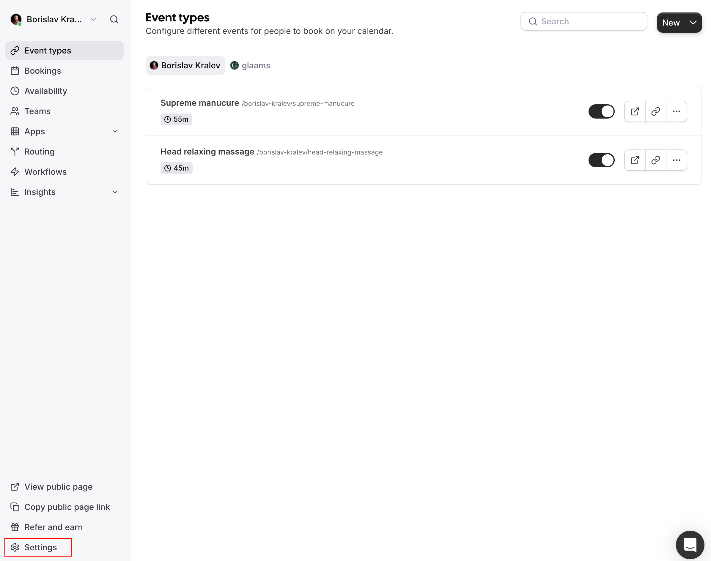

# GLAAMS Project Instructions

This document describes the instructions for working with the GLAAMS project, including adding specialists, services, configurations, and other administrative tasks. It covers the full process from cal.com setup to creating records in GLAAMS CMS.

---

## 1. Adding a Specialist in cal.com (Admin)

**Performed by:** Administrator

The administrator adds the specialist to cal.com in the **glaams** team as **MEMBER**.

### Screenshots:




---

## 2. Specialist Registration in cal.com (Specialist)

**Performed by:** Specialist

The specialist registers in cal.com via the automatically sent email link.

---

## 3. Profile Setup in cal.com (Specialist)

**Performed by:** Specialist

The specialist configures the required fields in their profile:

- **Name**
- **Email**
- **Language**
- **Timezone**
- **Time format**
- **Start of week**
- **Google calendar** – selected for synchronization
- **Availability** – set the days of the week and time ranges when the specialist will offer their services. This information appears on the specialist’s page as “Working hours” and is general in nature. Absences, holidays, personal commitments, etc. can be added later via Google calendar, so the specialist controls when they are actually available.

### Screenshots:


---

## 4. Creating Event Types in cal.com (Specialist)

**Performed by:** Specialist

The specialist adds their own Event Types:

### Steps:

1. **Create a new Event Type:**
   - Add title
   - Add description
   - Set duration

2. **Location setup:**
   - **Mandatory:** select “**In Person (Attendee Address)**”
   - This means the service is performed at the client’s address

3. **Save settings**


---

## 5. Setting Limits in cal.com (Specialist)

**Performed by:** Specialist

The specialist sets the following limits:

- **Buffer time before event**
- **Buffer time after event**
- **Time-slot interval** – the time options shown on the specialist’s services page


---

## 6. Adding a Specialist in GLAAMS (Admin)

**Performed by:** Administrator

### Steps:

1. **Access Content Manager:**
   - Content Manager → Specialist → Create new entry

2. **Fill required fields:**
   - All required fields must be filled
   - Most information should be provided by the specialist or taken from their cal.com profile

3. **Important fields:**
   - **Languages** – used for filtering in the specialist listing
   - **Locations** – used for filtering in the specialist listing
   - **Services** – used for filtering in the specialist listing
     - ⚠️ **Important:** If the specialist offers a service that is not yet added, the Service must be added first

4. **“calUsername” field:**
   - Fill with the **Username** from the specialist’s cal.com profile
   - This field is critical for linking GLAAMS and cal.com

5. **“serviceConfigs” field:**
   - ⚠️ **Do not edit** – it will be filled automatically after the specialist’s configurations are created

6. **Save:**
   - Save
   - Publish

---

## 7. Creating Specialist Configurations (Admin)

**Performed by:** Administrator

### Steps:

1. **Access Content Manager:**
   - Content Manager → Service Specialist Config → Create new entry

2. **Select specialist and service:**
   - Select the specialist (already created in the previous step)
   - Select the service

3. **Fill “Cal Event Type Id”:**
   - ⚠️ **Critical field**
   - Fill with the value taken from cal.com
   - This is the Event Type ID, which can be copied from the page URL:
     ```
     app.cal.com/event-types/XXXXXXX?tabName=setup
     ```
     - The number marked as `XXXXXXX` in the example is the Event Type ID
   - This ID links the GLAAMS configuration to the Event Type in cal.com

4. **Fill remaining fields:**
   - **Duration** – can be taken from cal.com
   - **Title** – can be taken from cal.com
   - **Description** – can be taken from cal.com
   - **Price** – **set here**, not taken from cal.com

5. **Image:**
   - If no image is added, the one from the linked service will be used

6. **Save:**
   - Save
   - Publish

---

## 8. Adding a Main Service (Admin)

**Performed by:** Administrator

### Description:

Main services appear in:
- The “Treatments” sections on the site
- The “All treatments” filter field

These are intended to have their own informational pages.

### Fields to fill:

- **Page title** – displayed on the service’s frontend
- **Short description** – displayed on the service’s frontend
- **How It Works** (section) – displayed on the service’s frontend
- **FAQ** (section) – displayed on the service’s frontend
- **Benefits** (section) – displayed on the service’s frontend
- **Sub-services** – select one or more options

### Fields that must not be edited:

- **specialists** – do not edit
- **specialistConfigs** – do not edit

### Sub Service:

Sub Service is created similarly to a service, with the difference that:
- Sub-services **do not have pages**
- They are added to link to a main service

---

## 9. Adding CMS User for Specialist (Admin)

**Performed by:** Administrator

### Purpose:

A user is created in Strapi and linked to the specialist. This allows the specialist to:
- Log into the GLAAMS system
- View statistics for their bookings
- Edit their information
- Change their password
- Add gallery images

### Steps:

1. **Access Content Manager:**
   - Content Manager → User → Create new entry

2. **Fill fields:**
   - **username** – the specialist’s username
   - **email** – the email used to register the specialist in cal.com
   - **password** – access password
   - **confirmed** – `true`
   - **role** – `Authenticated`
   - **specialist** – select the specialist created in step 6 from the dropdown

3. **Save:**
   - Save
   - Publish

---

## Important notes

- All steps must be performed in the given order
- The “Cal Event Type Id” field is critical for the system to work correctly
- Services must be created before adding a specialist if the specialist offers a service that does not exist yet
- After configurations are created, the “serviceConfigs” field in the specialist’s profile is filled automatically
